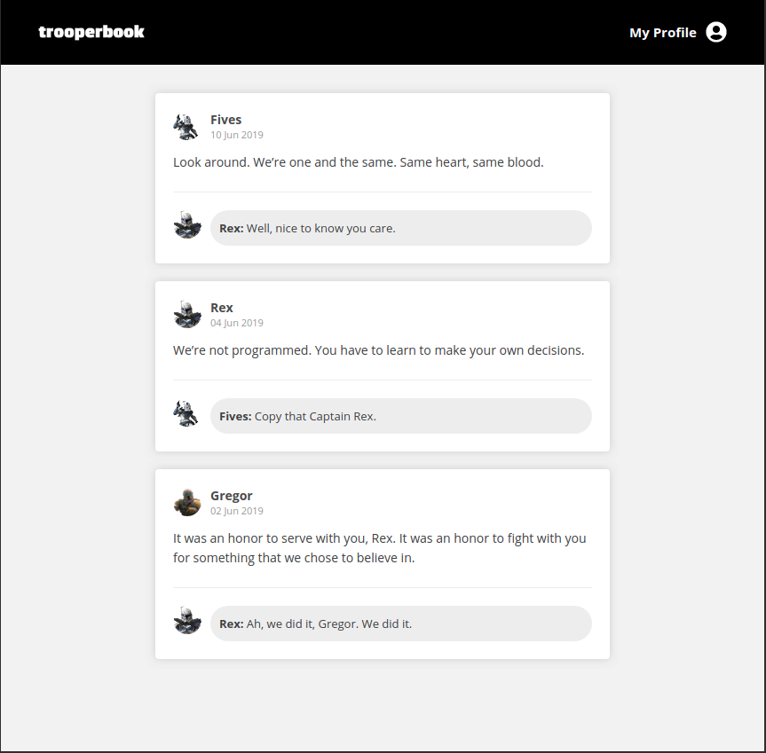

# Trooper Book


This was a project i made to gain familiarity building a React application from scratch, configuring Babel and Webpack. For styling, I used Styled Components.

### Introduction

The goal of the application is to reproduce a social media feed. Including a  header, a content area with a post that includes comments.



### Running

To run the application:

```bash
yarn
yarn dev
```

